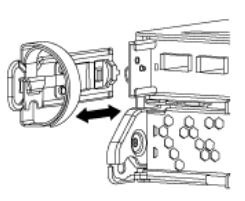

= Replace the AFF A220, AFF A200, AFF C190, FAS2620, or FAS2720 controller module
:hardbreaks:
:nofooter:
:icons: font
:linkattrs:
:imagesdir: ./media/

[.lead]
At this stage, node1 is down and all data is served by node2. Because node1 and node2 are in the same chassis and powered by the same set of power supplies, do NOT power off the chassis. You must take care to remove only the node1 controller module. Typically, node1 is controller A, located on the left side of the chassis when looking at the controllers from the rear of the system. The controller label is located on the chassis directly above the controller module.

.Before you begin
If you are not already grounded, correctly ground yourself.

== Remove the AFF A220, AFF A200, AFF C190, FAS2620, or FAS2720 controller module
To access components inside the controller, remove the controller module from the system and then remove the cover on the controller module.

.Steps
. Loosen the hook and loop strap binding the cables to the cable management device, and then unplug the system cables and SFPs (if needed) from the controller module, keeping track of where the cables were connected.
+
Leave the cables in the cable management device so that when you reinstall the cable management device, the cables are organized.

. Remove and set aside the cable management devices from the left and right sides of the controller module.
+

. Squeeze the latch on the cam handle until it releases, open the cam handle fully to release the controller module from the midplane, and then, using two hands, pull the controller module out of the chassis.
+
image::../media/drw_2240_x_opening_cam_latch.png[Opening the cam handle]

. Turn the controller module over and place it on a flat, stable surface.

== Install the ASA A150, AFF A150, or FAS2820 controller module
Install, cable, and connect the ASA A150, AFF A150, or FAS2820 controller module in node1.

.Steps
. Align the end of the controller module with the opening in the chassis, and then gently push the controller module halfway into the system.
+
NOTE: Do not completely insert the controller module in the chassis until instructed to do so later in the procedure.

. Cable the management and console ports to the node1 controller module.
+
NOTE: Because the chassis is already powered ON, node1 starts BIOS initialization followed by AUTOBOOT as soon as it is fully seated. To interrupt the node1 boot, before completely inserting the controller module into the slot, it is recommended that you connect the serial console and management cables to the node1 controller module.

. With the cam handle in the open position, firmly push the controller module in until it meets the midplane and is fully seated. The locking latch rises when the controller module is fully seated. Close the cam handle to the locked position.
+
NOTE: To avoid damaging the connectors, do not use excessive force when sliding the controller module into the chassis.

. Connect the serial console as soon as the module is seated and be ready to interrupt AUTOBOOT of node1.
. After you interrupt AUTOBOOT, node1 stops at the LOADER prompt. If you do not interrupt AUTOBOOT on time and node1 starts booting, wait for the prompt and press Ctrl-C to go into the boot menu. After the node stops at the boot menu, use option `8` to reboot the node and interrupt AUTOBOOT during reboot.
. At the LOADER> prompt of node1, set the default environment variables:
+
`set-defaults`

. Save the default environment variables settings:
+
`saveenv`

// 2023 AUG 29, AFFFASDOC-78
// 2023 MAY 29, AFFFASDOC-39
// 2022-OCT-24, BURT 1506458
// 2022-APR-27, BURT 1452254
